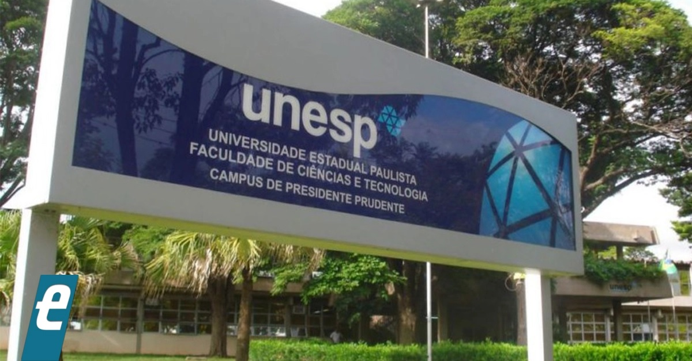

```{r setup, include=FALSE}
options(htmltools.dir.version = FALSE)
knitr::opts_chunk$set(echo = FALSE,
                      comment = '',
                      message = FALSE,
                      warning = FALSE,
                      cache = TRUE)
```
<style>
#caixa {
  border: 1px solid;
  padding: 10px;
  box-shadow: 5px 10px blue;
}
div {
  text-align: justify;
  text-justify: inter-word;
}
</style>

# Formação &#127891;

&#10004; Bacharel em Estatística

```{r , echo=FALSE, fig.align = 'center', out.width = '35%'}

```

<br>

--

&#10004; Mestrado e Doutorado em Ciências

```{r , echo=FALSE, fig.align = 'center', out.width = '45%'}
knitr::include_graphics('figuras/esalq.jpg')
```

---

# Universidades &#127979;

&#10004; Unoeste

```{r , echo=FALSE, fig.align = 'center', out.width = '25%'}
knitr::include_graphics('figuras/logo_unoeste.jpg')
```

<br>

&#10004; UEM

```{r , echo=FALSE, fig.align = 'center', out.width = '25%'}
knitr::include_graphics('figuras/logo_uem.jpg')
```

<br>

&#10004; UTFPR

```{r , echo=FALSE, fig.align = 'center', out.width = '25%'}
knitr::include_graphics('figuras/utfpr.jpg')
```

---

# Apresentar-se

- Nome, o curso

<br>

- Em qual disciplina você teve mais facilidade e em qual teve mais dificuldade.

```{r , echo=FALSE, fig.align = 'right', out.width = '60%'}
knitr::include_graphics('https://media.giphy.com/media/TKNGghpLhaz9XH1tSj/giphy.gif')
```

---

# Objetivo da disciplina &#127919;

<div id="caixa">
 <div>O objetivo é proporcionar aos alunos de graduação em Engenharia de Química uma introdução aos <font color="#0066cc">conceitos de estatística</font> utilizados na análise de dados, bem como o desenvolvimento da capacidade de <font color="#0066cc">interpretar os resultados</font> e estabelecer uma linguagem comum entre o Engenheiro e o Estatístico.</div>
</div>

.pull-left[
Horário da Aula &#9200;
]
.pull-right[
- Quarta-feira das 10:20--12:00

- Sexta-feira das 10:20--12:00

- **Tolerância**: 10 minutos
]

<br>

--

.pull-left[
Horário de Atendimento &#9200;
]
.pull-right[
- Terça-feira das 20:20-21:10

- Quarta-feira das 13:00-14:40

- Sexta-feira das 9:10-10:00
]

---

# Conteúdo Programático &#128214;

&#10004; Conceitos básicos de estatística descritiva

```{r , echo=FALSE, fig.align = 'center', out.width = '40%'}

```

<br>

--

&#10004; Conceitos básicos de probabilidade

```{r , echo=FALSE, fig.align = 'center', out.width = '40%'}
knitr::include_graphics('figuras/fig3.jpg')
```

---

&#10004; Conceitos básicos Variável aleatória e modelos de distribuição de probabilidade.

```{r , echo=FALSE, fig.align = 'center', out.width = '50%'}
knitr::include_graphics('figuras/fig4.jpg')
```

<br>

--

&#10004; Conceitos básicos de inferência estatística.

```{r , echo=FALSE, fig.align = 'center', out.width = '50%'}
knitr::include_graphics('figuras/fig5.jpg')
```

---

&#10004; Conceitos básicos de estatística experimental.

```{r , echo=FALSE, fig.align = 'center', out.width = '50%'}
knitr::include_graphics('figuras/fig6.jpg')
```

---

# Bibliografia básica &#128218;

&#10004; BUSSAB, Wilton de Oliveira; MORETTIN, Pedro Alberto. **Estatística básica**. 5ed. São Paulo: Saraiva, 2004. 526 p.

```{r , echo=FALSE, fig.align = 'center', out.width = '35%'}
knitr::include_graphics('figuras/fig8.jpg')
```

---

# Bibliografia básica &#128218;

&#10004; MONTGOMERY, Douglas C.; RUNGER, George C. **Estatística aplicada e probabilidade para engenheiros**. 4ed. Rio de Janeiro, RJ: LTC, 2009, 493 p.

```{r , echo=FALSE, fig.align = 'center', out.width = '35%'}
knitr::include_graphics('figuras/fig9.jpg')
```

---

# Bibliografia complementar &#128218;

- MORETTIN, L.G. **Estatística básica: probabilidade e inferência**, volume único. São Paulo: Pearson Prentice Hall, 2009. 375 p.

<br>

- SPIEGEL, M.R.; SCHILLER, J.J.; SRINIVASAN, R.A. **Teoria e problemas de probabilidade e estatística**. 2.ed. São Paulo: McGraw-Hill, 2004. 398 p.

<br>

- FONSECA, J.S.; MARTINS, G.A. **Curso de estatística**. 6.ed. São Paulo: Atlas, 1996. 320 p.

---

# Aulas &#128210;

&#10004; **Participar** da resolução dos exemplos, bem como do desenvolvimento de algum método quando for chamado.

```{r, eval=FALSE, echo=FALSE, fig.align = 'center', out.width = '30%'}
knitr::include_graphics('figuras/tarefa.jpg')
```


&#10004; **Questionar** quando tiver dúvidas.

```{r , echo=FALSE, fig.align = 'right', out.width = '60%'}
knitr::include_graphics('https://media.giphy.com/media/STThOmSL9X8jpaEqfE/giphy.gif')
```

---

# Lista de exercícios &#9997;

Haverá listas de exercícios para serem resolvidas em casa. Resolver os problemas da lista de exercícios é uma forma de aprendizagem, pois é uma maneira de colocar em prática tudo que você leu e ouviu, e vai lhe fornecer um *feedback* sobre o que foi abordado em sala de aula.

```{r , echo=FALSE, fig.align = 'center', out.width = '30%'}
knitr::include_graphics('https://media.giphy.com/media/1oBwBVLGoLteCP2kyD/giphy.gif')
```


&#10004; Vocês são **encorajados** a resolver problemas com os outros estudantes, compartilhar e discutir ideias.


&#10004; As respostas de cada problema devem ser **resultados de seu próprio esforço**.

---

# Complementação de carga horária

.pull-left[

&#10004; Quizzes sobre conceitos teóricas e aplicações

&#10004; Leitura.
]
.pull-right[

]

<br>

```{r , echo=FALSE, fig.align = 'right', out.width = '40%'}
knitr::include_graphics('https://media.giphy.com/media/xTiQywlOn0gKyz0l56/giphy.gif')
```

---

# Provas &#128221;

Haverá três avaliações que vão cobrir o conteúdo abordado em sala de aula, as listas de exercícios e as bibliografias citadas. As soluções de cada uma das provas devem estar bem **organizadas** e **justificadas**. Desta forma, você irá demonstrar sua capacidade de comunicar os seus resultados. Se a prova estiver **difícil de compreender** devido a organização e passagens não justificadas, haverá **penalidades**.

Qualquer conflito com as datas das provas devem ser comunicados na **segunda semana de aula**.

<br>

.pull-left[
<center>Prova 1</center>

Quarta-feira, **05/04**
]
.pull-right[
<center>Prova 2</center>

Quarta-feira, **17/05**
]

.pull-left[
<center>Prova 3</center>

Quarta-feira, **28/06**
]
.pull-right[
]

---

# Prova de segunda chamada &#128221;

No caso do aluno perder, **por motivo de doença ou força maior**, alguma avaliação, poderá solicitar, através de requerimento, uma única segunda chamada por avaliação, desde que no prazo determinado no Regulamento da Organização Didático-Pedagógica dos Cursos da UTFPR (Art.36 - Graduação e Art.31 - Técnico)

<br>

.pull-left[
<center>Prova de Segunda Chamada</center>

Quarta-feira, **05/07**
]
.pull-right[

]

<br>

Trabalho ou viagem a passeio **não são motivos** para segunda chamada.

---

# Critério de avaliação &#128220;

Resolução 122/10-COEPP/Artigo 4:

&#10004; Será **aprovado** o aluno com 75% de presença e obtiver  $MF\geq6$, em que
		$$MF=\frac{P1+P2+P3}{3},$$
é a média final e $Pi (i=1,2,3)$ é a nota da $i$-ésima avaliação.

<br>

--

&#128680; O aluno com presença entre **25% à 50%**, será aprovado se $MF\geq8$.

<br>

--

&#10004; Para $MF$ poderá ser acrescentado um bônus por engajamento de no **máximo** 0,5 pontos a depender da decisão da turma.

---

&#10004; O aluno com $MF<6$ deverá fazer a prova de recuperação (**matéria toda** e **sem consulta**) no dia 07-07-2023. A média final será recalculada por
$$MFr=\frac{MF+NR}{2},$$
em que $NR$ é a nota da prova de recuperação. Então, a nota final será determinada pela expressão

$$NF=\min(6,MPr).$$
Será aprovado o aluno com $NF\geq6$.

<br>

--

&#128680; **Aviso**

Bônus e pontos extras não serão considerados para o cálculo da média da prova de recuperação.

---

# Cópia de provas (e/ou *internet*) e falsidade

```{r , echo=FALSE, fig.align = 'center', out.width = '40%'}
knitr::include_graphics('https://media.giphy.com/media/SRqTQmbYdm5jgS7xH9/giphy.gif
')
```

A desonestidade em nosso trabalho acadêmico representa uma **grave violação ética**.

<br>

Para maiores detalhes, consulte o **regulamento disciplinar do corpo discente da UTFPR**

<https://portal.utfpr.edu.br/documentos/graduacao-e-educacao-profissional/prograd/diretrizes-e-regulamentos/gestao/regulamento-disciplinar-do-corpo-discente/view>

---

# Não divulgar informações falsas!

```{r , echo=FALSE, fig.align = 'center', out.width = '50%'}
knitr::include_graphics('https://media.giphy.com/media/3orieNLnAxzZI9CQzm/giphy.gif?cid=ecf05e47gv1g9buos2wnbph6pwbmk45fp0luz268sanoyrru&rid=giphy.gif&ct=g')
```

**Faça questionamentos** sobre as informações a respeito dos tópicos da disciplina.

**Relembre** o que foi passado em sala de aula.

---

# Espera-se do aluno de graduação

&#10004; Dedicado com a disciplina.


&#10004; Base de matemática elementar.


&#10004; Conhecimento de derivada e integral.


&#10004; Respeite a professora e demais colegas.

```{r , echo=FALSE, fig.align = 'center', out.width = '50%'}
knitr::include_graphics('https://media.giphy.com/media/KM9Oag1SJ7PiyoWUEW/giphy.gif')
```

---

```{r , echo=FALSE, fig.align = 'center', out.width = '50%'}
knitr::include_graphics('https://media.giphy.com/media/3o7TKwmnDgQb5jemjK/giphy.gif')
```


- Não utilizar o celular durante a aula, a menos que seja pedido;

<br>

--

- Não dormir em aula;

<br>

--

- Não utilizar o *notebook*, a menos que seja pedido;

<br>

--

- Prestar atenção quando um colega estiver fazendo perguntas.

---

# Refletir

**Eu terei tempo** para me dedicar a disciplina?

**Minha base matemática do ensino médio** é suficiente a disciplina?

**Aprendi e consigo aplicar os conceitos** de Cálculo I?

<br>

```{r , echo=FALSE, fig.align = 'center', out.width = '40%'}
knitr::include_graphics('https://media.giphy.com/media/xThtanqVawzQNeHD20/giphy.gif')
```

---

# 

&#10004; <https://moodle.utfpr.edu.br/login/index.php>

<br>

&#10004; Londrina - Graduação - Engenharia Química - 2o período

<br>

&#10004; Disciplina: 2023 - S1 - Probabilidade e Estatística

<br>

.pull-left[
&#10004; Senha: MA65AEQ2023
]
.pull-right[
```{r , echo=FALSE, fig.align = 'left', out.width = '80%'}
knitr::include_graphics('https://media.giphy.com/media/IoP0PvbbSWGAM/giphy.gif')
```
]

<br>
