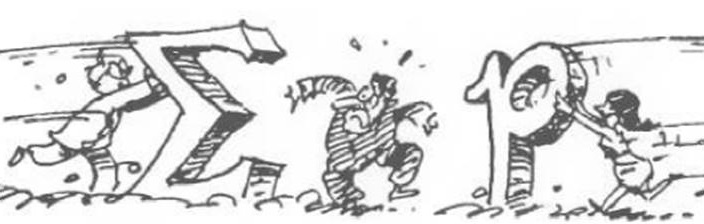
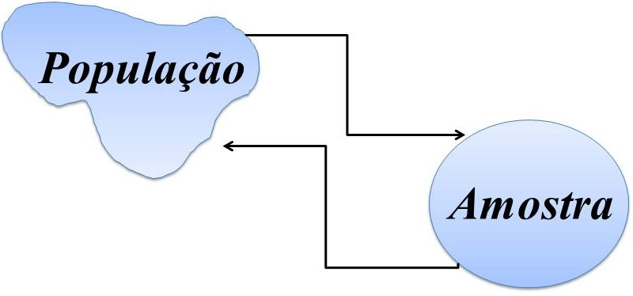

```{r setup, include=FALSE}
options(htmltools.dir.version = FALSE)
knitr::opts_chunk$set(echo = FALSE,
                      comment = '',
                      message = FALSE,
                      warning = FALSE,
                      cache = TRUE)
```
<style>
#caixa {
  border: 1px solid;
  padding: 10px;
  box-shadow: 5px 10px blue;
}
div {
  text-align: justify;
  text-justify: inter-word;
}
</style>

# Objetivo da disciplina &#127919;

<div id="caixa">
 <div>
 Adquirir <font color="#0066cc">conceitos básicos</font> de Estatística aplicados à Engenharia Mecânica. Aprender a representar e sintetizar informações.
 </div>
</div>

--

<br>

.pull-left[
Horário da Aula &#9200;
]
.pull-right[
- Quinta-feira das 07:30--09:10

- Sexta-feira das 11:10--13:00

- **Tolerância**: 10 minutos
]

<br>

--

.pull-left[
Horário de Atendimento &#9200;
]
.pull-right[
- Quarta-feira das 15:50-17:30

- Quinta-feira das 9:10-10:00
]

---

# Conteúdo Programático &#128214;

&#10004; Conceitos básicos Variável aleatória e modelos de distribuição de probabilidade.

```{r , echo=FALSE, fig.align = 'center', out.width = '50%'}

```

<br>

--

&#10004; Conceitos básicos de inferência estatística.

```{r , echo=FALSE, fig.align = 'center', out.width = '50%'}

```

---

&#10004; Conceitos básicos de estatística experimental.

```{r , echo=FALSE, fig.align = 'center', out.width = '50%'}
knitr::include_graphics('figuras/fig6.jpg')
```

---

# Sala de Aula &#128105;&#8205;&#127979;

&#10004; **Participar** da resolução dos exemplos.

```{r , echo=FALSE, fig.align = 'center', out.width = '25%'}
knitr::include_graphics('https://media.giphy.com/media/v1.Y2lkPTc5MGI3NjExaDI1aWp1MXRpOWEyZ21yanA3bWRiNDU1YTRpYzd2bjRxNTg4bmUyNiZlcD12MV9pbnRlcm5hbF9naWZfYnlfaWQmY3Q9Zw/06aA0f1QpAshEfFbFH/giphy.gif')
```

--

&#10004; **Questionar** quando tiver dúvidas.

```{r , echo=FALSE, fig.align = 'center', out.width = '30%'}
knitr::include_graphics('https://media.giphy.com/media/STThOmSL9X8jpaEqfE/giphy.gif')
```

---

# Sala de Aula &#128105;&#8205;&#127979;

```{r , echo=FALSE, fig.align = 'center', out.width = '40%'}
knitr::include_graphics('https://media.giphy.com/media/3o7TKwmnDgQb5jemjK/giphy.gif')
```


- **Não fica ao celular** durante a aula, a menos que seja pedido ou tenha uma ligação muito importante;

--

- **Não dormir** em aula;

--

- **Não utilizar o *notebook* **, a menos que seja pedido;

--

- **Não ficar entranto de saindo** da aula.

---
 
# Atividades extraclasse &#127969; 

&#9997; **Lista de exercícios** 

Resolver os problemas da lista de exercícios é uma maneira de colocar em prática tudo que você leu e ouviu, e vai lhe fornecer um *feedback* sobre o que foi abordado em sala de aula.

```{r , echo=FALSE, fig.align = 'center', out.width = '30%'}
knitr::include_graphics('https://media.giphy.com/media/1oBwBVLGoLteCP2kyD/giphy.gif')
```

&#10004; Vocês são **encorajados** a resolver problemas com os outros estudantes, compartilhar e discutir ideias.

&#10004; As respostas de cada problema devem ser **resultados de seu próprio esforço**.

---

# Atividades extraclasse &#127969; 

&#9997; **Resumo**

Para cada tópico da UC será elaborado um resumo a será entregue antes do ínicio das aulas em papel sulfite A4 ou almaço. 

Maiores detalhes serão divulgados no moodle.

---

# Atividades extraclasse &#127969; 

&#9997; **Complementação de carga horária**

.pull-left[

&#10004; Leitura do material de cada assunto da UC;

&#10004; Construção de tabelas e gráficos de distribuição de frequência; 

&#10004; Teste de hipótese para proporção.
]
.pull-right[

]

<br>

```{r , echo=FALSE, fig.align = 'right', out.width = '40%'}
knitr::include_graphics('https://media.giphy.com/media/xTiQywlOn0gKyz0l56/giphy.gif')
```
---

# Provas &#128221;

Haverá três avaliações que vão cobrir o conteúdo abordado em sala de aula, as listas de exercícios e as bibliografias citadas. As soluções de cada uma das provas devem estar bem **organizadas** e **justificadas**. Desta forma, você irá demonstrar sua capacidade de comunicar os seus resultados. Se a prova estiver **difícil de compreender** devido a organização e passagens não justificadas, haverá **penalidades**.

Qualquer conflito com as datas das provas devem ser comunicados na **segunda semana de aula**.

<br>

.pull-left[
<center>Prova 1</center>

Quinta-feira, **11/04**
]
.pull-right[
<center>Prova 2</center>

Quinta-feira, **30/08**
]

---

# Prova de segunda chamada &#128221;

No caso do aluno perder, **por motivo de doença ou força maior**, alguma avaliação, poderá solicitar, através de requerimento, uma única segunda chamada por avaliação, desde que no prazo determinado no Regulamento da Organização Didático-Pedagógica dos Cursos da UTFPR (Art.36 - Graduação e Art.31 - Técnico)

<br>

.pull-left[
<center>Prova de Segunda Chamada</center>

Quinta-feira, **06/09**
]
.pull-right[

]

<br>

Trabalho ou viagem a passeio **não são motivos** para segunda chamada.

---

# Critério de avaliação &#128220;

Resolução 122/10-COEPP/Artigo 4:

&#10004; Será **aprovado** o aluno com 75% de presença e obtiver  $MF\geq6$, em que
		$$MF=0,4(N1+P2)+0,2R,$$
é a média final, $N1 = P1+T$ ( $P1$ com no **máximo** de 8,0pontos e $T$ com no **máximo** de 2,0pontos), $P2$ (**máximo** de 10,0pontos) é a segunda prova e $R$ (**máximo** de 10,0pontos) são resumos dos conteúdos.

<br>

--

&#128680; O aluno com presença entre **25% à 50%**, será aprovado se $MF\geq8$.

<br>

--

&#10004; Para $MF$ poderá ser acrescentado um bônus por engajamento de no **máximo** 0,5 ponto.

---

&#10004; O aluno com $MF<6$ deverá fazer a prova de recuperação (**matéria toda** e **sem consulta**) no dia 13-09-2024. A média final será recalculada por
$$MFr=\frac{MF+NR}{2},$$
em que $NR$ é a nota da prova de recuperação. Então, a nota final será determinada pela expressão

$$NF=\min(6,MPr).$$
Será aprovado o aluno com $NF\geq6$.

<br>

--

&#128680; **Aviso**

Bônus e pontos extras não serão considerados para o cálculo da média da prova de recuperação.

---

# Cópia de provas (e/ou *internet* e/ou trabalhos e/ou resumos)

```{r , echo=FALSE, fig.align = 'center', out.width = '40%'}
knitr::include_graphics('https://media.giphy.com/media/SRqTQmbYdm5jgS7xH9/giphy.gif
')
```

A desonestidade em nosso trabalho acadêmico representa uma **grave violação ética**.

Para maiores detalhes, consulte o **regulamento disciplinar do corpo discente da UTFPR**

<https://portal.utfpr.edu.br/documentos/graduacao-e-educacao-profissional/prograd/diretrizes-e-regulamentos/gestao/regulamento-disciplinar-do-corpo-discente/view>

---

# Refletir

**Eu terei tempo** para me dedicar a UC?

**Eu vou levar** à sério a UC?

**Aprendi e consigo aplicar os conceitos** de Cálculo I?

<br>

```{r , echo=FALSE, fig.align = 'center', out.width = '40%'}
knitr::include_graphics('https://media.giphy.com/media/xThtanqVawzQNeHD20/giphy.gif')
```

---

# Cancelamento da Unidade Curricular

* Portal do aluno.

* Período: 25/07 à 02/08.

* Excepcionalmente o cancelamento desse período não irá contar no histórico do aluno.

<br>

Para maiores detalhes, veja a *live* da  **Conexão-UTFPR**

<https://www.youtube.com/watch?v=LyFmfzJfADM&t=1928s>
